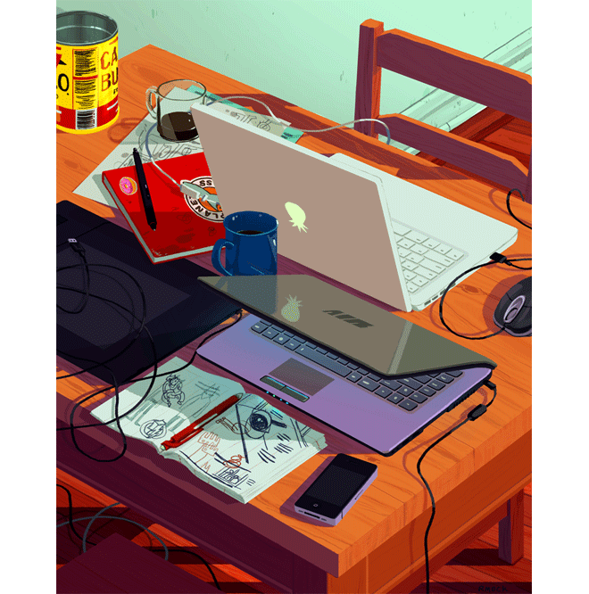

<p align="center">
  
</p>

<h1 align="center">
  
</h1>

<h3 align="center">⚡ Fullstack Developer | Open Source Nerd | Problem Solver from India 🇮🇳</h3>

<br>

<div align="center">
  
  &nbsp;&nbsp;&nbsp;&nbsp;
  
</div>

<br>

<p align="center">
  
  
</p>


## 🛸 `> whoami`

```js
const ankit = {
  pronouns: "he" | "him",
  location: "India 🇮🇳",
  currentlyBuilding: "AI-powered apps that actually help people",
  learning: ["React Native", "Machine Learning", "System Design"],
  askMeAbout: ["MERN Stack", "Android Dev", "Competitive Programming"],
  funFact: "I debug faster at 3 AM with lofi beats 🎧",
  motto: "Ship it or it doesn't exist 🚀",
};
```


##  Tech Arsenal

<div align="center">

### 💻 Languages

<p>
  
  
  
  
  
  
  
  
</p>

### 🧰 Frameworks & Libraries

<p>
  
  
  
  
  
  
  
  
  
</p>

### 🗄️ Databases & Cloud

<p>
  
  
  
  
</p>

### 🛠️ Tools & Platforms

<p>
  
  
  
  
  
  
  
</p>

</div>


## 🔌 Link Up

<div align="center">
  <a href="https://github.com/Ankit-Basu" target="_blank">
    
  </a>
  &nbsp;&nbsp;&nbsp;&nbsp;&nbsp;&nbsp;
  <a href="https://www.linkedin.com/in/ankit-basu-4a6774297/" target="_blank">
    
  </a>
  &nbsp;&nbsp;&nbsp;&nbsp;&nbsp;&nbsp;
  <a href="https://www.instagram.com/_ank1t._/" target="_blank">
    
  </a>
</div>

<br>

<div align="center">
  <a href="mailto:ankitbasu935@gmail.com">
    
  </a>
  <a href="https://www.linkedin.com/in/ankit-basu-4a6774297/">
    
  </a>
  <a href="https://twitter.com/Ankit_Basu03">
    
  </a>
</div>

<br>

<p align="center">
  
</p>


## 📊 Player Stats

<div align="center">
  
</div>

<br>

<div align="center">
  
  &nbsp;
  
</div>


## 🏆 Trophies

<div align="center">
  
</div>


## 🐍 Contribution Snake

<div align="center">
  <picture>
    <source media="(prefers-color-scheme: dark)" srcset="https://raw.githubusercontent.com/Ankit-Basu/Ankit-Basu/output/github-snake-dark.svg" />
    <source media="(prefers-color-scheme: light)" srcset="https://raw.githubusercontent.com/Ankit-Basu/Ankit-Basu/output/github-snake.svg" />
    
  </picture>
</div>


## 📈 Contribution Graph

<div align="center">
  
</div>


## 💡 Wisdom Drops

<p align="center">
  
</p>


<div align="center">
  
  <br><br>
  
</div>

<br>

<p align="center">
  <em>Stay frosty, keep coding.</em> 👾
</p>
